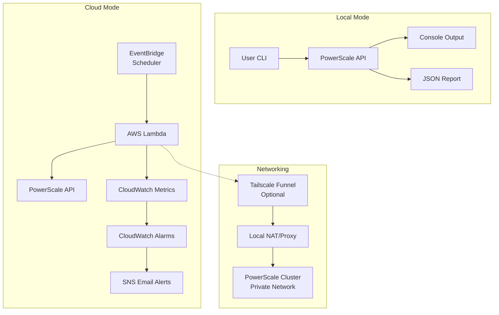
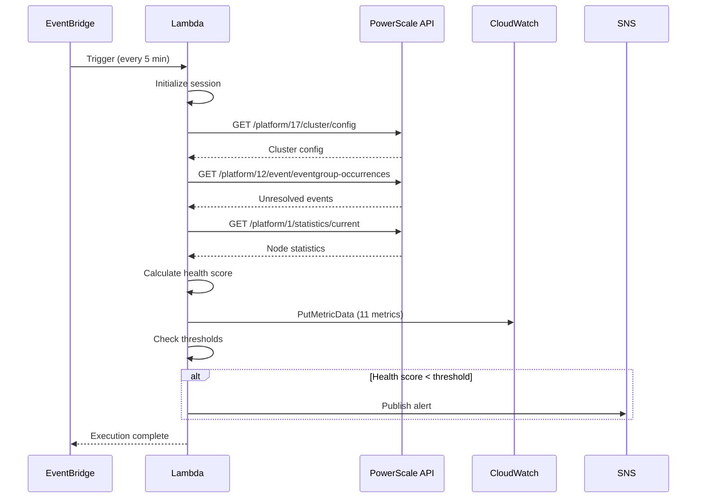
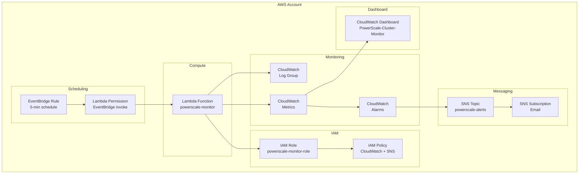
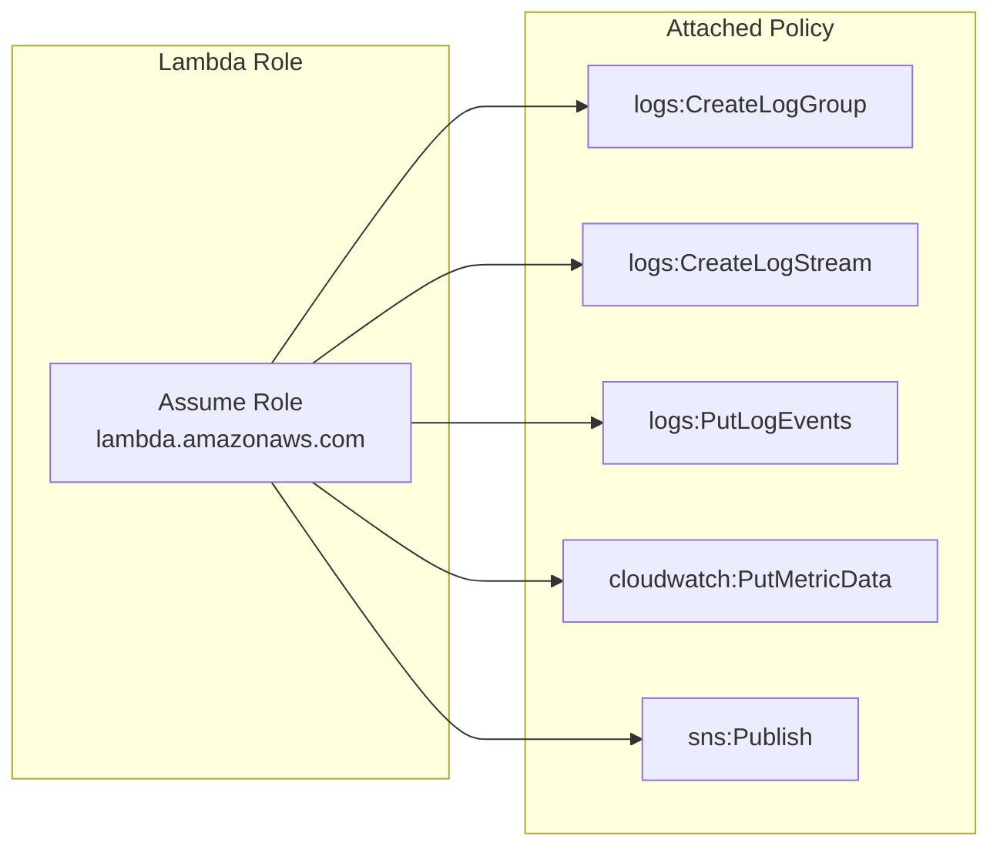
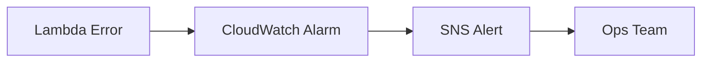

# Architecture Documentation

## System Overview

The PowerScale Cluster Monitor is a dual-mode monitoring system that can operate as:
1. **Local CLI**: For ad-hoc monitoring and debugging
2. **AWS Lambda**: For automated, scheduled monitoring with cloud-native observability

## High-Level Architecture



## Component Architecture

### Local CLI Mode

```
┌─────────────────────────────────────────────────────────┐
│                     User Interface                        │
│  (Command Line Arguments / Environment Variables / YAML)  │
└────────────────────┬────────────────────────────────────┘
                     │
                     ▼
┌─────────────────────────────────────────────────────────┐
│              PowerScale Cluster Monitor                   │
│  ┌──────────────┐  ┌──────────────┐  ┌──────────────┐  │
│  │ Config Parser│  │ API Client   │  │ Event Parser │  │
│  └──────────────┘  └──────────────┘  └──────────────┘  │
│  ┌──────────────┐  ┌──────────────┐  ┌──────────────┐  │
│  │ Health Score │  │ Metric Calc  │  │ Alert Engine │  │
│  └──────────────┘  └──────────────┘  └──────────────┘  │
└────────────────────┬────────────────────────────────────┘
                     │
        ┌────────────┴────────────┐
        │                         │
        ▼                         ▼
┌──────────────┐         ┌──────────────┐
│ Console Out  │         │ JSON Report  │
└──────────────┘         └──────────────┘
```

### AWS Lambda Mode

```
┌─────────────────────────────────────────────────────────┐
│                    EventBridge                          │
│              (Rate: 5 minutes)                          │
└────────────────────┬────────────────────────────────────┘
                     │
                     ▼
┌─────────────────────────────────────────────────────────┐
│                    AWS Lambda                            │
│  Runtime: Python 3.12                                    │
│  Memory: 128-256 MB                                      │
│  Timeout: 30 seconds                                     │
└────────────────────┬────────────────────────────────────┘
                     │
        ┌────────────┴────────────┐
        │                         │
        ▼                         ▼
┌──────────────┐         ┌──────────────┐
│PowerScale API │         │CloudWatch    │
│  (HTTPS)      │         │   Metrics    │
└──────────────┘         └──────┬───────┘
                                │
                    ┌───────────┴───────────┐
                    │                       │
                    ▼                       ▼
            ┌──────────────┐       ┌──────────────┐
            │CloudWatch    │       │   SNS        │
            │   Alarms     │       │   Alerts     │
            └──────────────┘       └──────────────┘
```

## Data Flow

### Monitoring Cycle



### API Endpoints

| Endpoint | Purpose | Data Retrieved |
|----------|---------|-----------------|
| `/platform/17/cluster/config` | Cluster configuration | Node status, quorum, version |
| `/platform/12/event/eventgroup-occurrences` | Event monitoring | Unresolved events by severity |
| `/platform/1/statistics/current` | Performance metrics | CPU, disk, memory statistics |

## Cloud Infrastructure

### AWS Resources Created



### Resource Details

| Resource | Purpose | Configuration |
|----------|---------|---------------|
| **Lambda Function** | Monitoring logic | Python 3.12, 128-256 MB, 30s timeout |
| **IAM Role** | Lambda permissions | Trust: lambda.amazonaws.com |
| **IAM Policy** | Resource access | CloudWatch metrics, logs, SNS publish |
| **SNS Topic** | Alert notifications | Email subscription |
| **EventBridge Rule** | Scheduling | rate(5 minutes) |
| **CloudWatch Metrics** | Custom metrics | 11 metrics in PowerScale/Cluster namespace |
| **CloudWatch Alarms** | Threshold monitoring | 3 pre-configured alarms |
| **CloudWatch Log Group** | Lambda logs | 7-day retention |
| **CloudWatch Dashboard** | Visualization | Cluster health metrics |

## Networking Architecture

### Direct Connection (Simple)

```
┌──────────────┐
│  AWS Lambda  │
│              │
│  Public IP   │
└──────┬───────┘
       │
       │ HTTPS
       │
┌──────▼───────┐
│ PowerScale   │
│   Cluster    │
│  (Public IP) │
└──────────────┘
```

### Tailscale Funnel (Recommended for Private Clusters)

```
┌──────────────┐
│  AWS Lambda  │
│              │
│  Public IP   │
└──────┬───────┘
       │
       │ HTTPS (Public)
       │
┌──────▼───────┐
│ Tailscale    │
│   Funnel     │
│  (Public)    │
└──────┬───────┘
       │
       │ Tailscale Tunnel (Encrypted)
       │
┌──────▼───────┐
│ Local NAT/   │
│   Proxy      │
└──────┬───────┘
       │
       │ Private Network
       │
┌──────▼───────┐
│ PowerScale   │
│   Cluster    │
│ (Private IP) │
└──────────────┘
```

### VPC with VPN (Enterprise)

```
┌──────────────┐
│  AWS Lambda  │
│   in VPC     │
└──────┬───────┘
       │
       │ VPN Tunnel
       │
┌──────▼───────┐
│ On-Prem      │
│   Network    │
└──────┬───────┘
       │
┌──────▼───────┐
│ PowerScale   │
│   Cluster    │
└──────────────┘
```

## Security Architecture

### Authentication Flow

```
┌──────────────┐
│   Lambda     │
└──────┬───────┘
       │
       │ 1. Retrieve credentials
       │    from environment variables
       │
┌──────▼───────┐
│  Environment  │
│   Variables  │
│  (Encrypted) │
└──────┬───────┘
       │
       │ 2. Basic Auth
       │
┌──────▼───────┐
│ PowerScale   │
│   API        │
└──────────────┘
```

### IAM Permissions



## Health Scoring Algorithm

```
Initial Score: 100
    │
    ├─ Critical Event: -20 points
    ├─ Warning Event:   -5 points
    │
    ▼
Final Score: max(0, 100 - (critical × 20) - (warning × 5))

Score Ranges:
├─ 80-100: HEALTHY
├─ 50-79:  DEGRADED
└─ 0-49:   CRITICAL
```

## Metrics Collected

| Metric | Type | Description | Thresholds |
|--------|------|-------------|------------|
| HealthScore | Gauge | Overall cluster health (0-100) | Critical: <50, Degraded: <80 |
| UnresolvedEvents | Count | Total unresolved events | - |
| CriticalEvents | Count | Critical severity events | - |
| WarningEvents | Count | Warning severity events | - |
| TotalNodes | Count | Total nodes in cluster | - |
| UpNodes | Count | Nodes currently up | - |
| DownNodes | Count | Nodes currently down | Critical: >0 |
| HasQuorum | Gauge | Quorum status (0/1) | - |
| AvgCpuIdle | Gauge | Average CPU idle % | - |
| AvgCpuUsed | Gauge | Average CPU used % | - |
| AvgDiskBusy | Gauge | Average disk busy % | - |

## Deployment Patterns

### Development Environment

```
┌─────────────────────────────────┐
│   Development AWS Account        │
│                                  │
│  ┌──────────────────────────┐   │
│  │ Lambda (dev-monitor)     │   │
│  │ Schedule: 30 minutes      │   │
│  │ Alerts: dev@example.com   │   │
│  └──────────────────────────┘   │
└─────────────────────────────────┘
```

### Production Environment

```
┌─────────────────────────────────┐
│   Production AWS Account         │
│                                  │
│  ┌──────────────────────────┐   │
│  │ Lambda (prod-monitor)     │   │
│  │ Schedule: 5 minutes       │   │
│  │ Alerts: oncall@example.com│   │
│  │ Memory: 256 MB            │   │
│  │ Timeout: 60 seconds       │   │
│  └──────────────────────────┘   │
│                                  │
│  ┌──────────────────────────┐   │
│  │ CloudWatch Alarms         │   │
│  │ + PagerDuty Integration   │   │
│  └──────────────────────────┘   │
└─────────────────────────────────┘
```

## Technology Stack

| Component | Technology | Version |
|-----------|------------|---------|
| **Runtime** | Python | 3.12 |
| **HTTP Client** | requests | Latest |
| **AWS SDK** | boto3 | Latest |
| **Infrastructure** | Terraform | 1.5.7 |
| **CI/CD** | GitHub Actions | - |
| **Testing** | pytest | Latest |
| **Code Quality** | flake8, pylint, black | Latest |

## Cost Architecture

### Monthly Cost Breakdown (us-east-1)

| Service | Component | Quantity | Unit Cost | Monthly Cost |
|---------|-----------|----------|-----------|--------------|
| Lambda | Invocations | 8,640 | $0.20/1M | $0.002 |
| Lambda | Compute (128MB) | 8,640 × 0.5s | $0.00001667/GB-s | $0.07 |
| CloudWatch | Custom Metrics | 11 | $0.30/metric | $3.30 |
| CloudWatch | Alarms | 3 | $0.00 (free tier) | $0.00 |
| CloudWatch | Logs | ~0.1 GB | $0.50/GB | $0.05 |
| SNS | Email | ~10 | $0.64/1M | $0.01 |
| **Total** | | | | **~$3.43** |

### Cost Optimization Strategies

1. **Reduce frequency**: 5 min → 15 min saves ~66% Lambda costs
2. **Optimize memory**: Find optimal memory setting
3. **Reduce metrics**: Comment out non-essential metrics
4. **Reduce log retention**: 7 days → 3 days

## Monitoring the Monitor

### Self-Monitoring Checklist

- [ ] Lambda execution duration < 30s
- [ ] Lambda error rate = 0%
- [ ] CloudWatch metrics appearing consistently
- [ ] SNS alerts delivered successfully
- [ ] No credential rotation failures
- [ ] Terraform state is secure
- [ ] Cost within expected range

### Alert on Monitoring Failure



## Extensibility Points

### Adding Custom Metrics

```python
def put_custom_metric(self, metric_name: str, value: float):
    self.put_cloudwatch_metric(f"Custom/{metric_name}", value)
```

### Adding New Alert Channels

```python
def send_slack_alert(self, webhook_url: str, message: str):
    requests.post(webhook_url, json={"text": message})
```

### Supporting Additional OneFS Versions

```python
def get_version_specific_endpoint(self, version: str):
    endpoints = {
        "9.5": "/platform/17/cluster/config",
        "9.6": "/platform/18/cluster/config",
    }
    return endpoints.get(version, "/platform/17/cluster/config")
```

## Disaster Recovery

### Backup Strategy

- **Terraform State**: S3 with versioning enabled
- **Configuration**: Git repository with version control
- **Alert History**: CloudWatch Logs retention
- **Metrics History**: CloudWatch Metrics retention (15 months)

### Recovery Procedures

1. **Lambda Failure**: Redeploy via Terraform
2. **Terraform State Loss**: Restore from S3 backup
3. **Credential Compromise**: Rotate immediately via AWS IAM
4. **Region Outage**: Deploy to secondary region

## Compliance & Governance

### Security Best Practices

- ✅ No credentials in code
- ✅ IAM least privilege
- ✅ Encrypted environment variables (KMS)
- ✅ VPC endpoints for private clusters
- ✅ Regular credential rotation
- ✅ CloudTrail logging enabled

### Audit Trail

- **Terraform Changes**: CloudTrail + Terraform state
- **Lambda Invocations**: CloudWatch Logs
- **API Access**: PowerScale audit logs
- **Configuration Changes**: Git commit history
